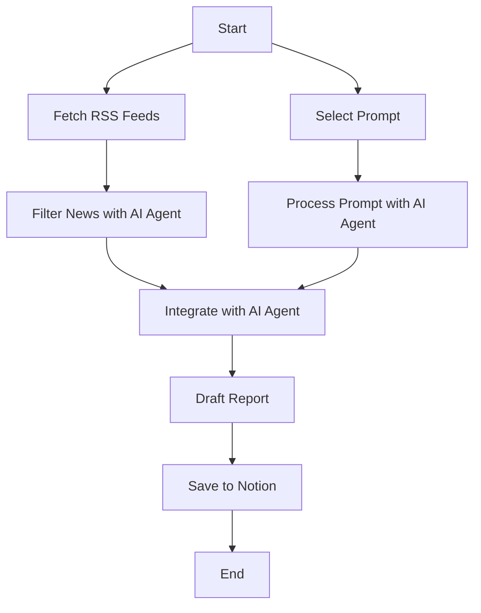
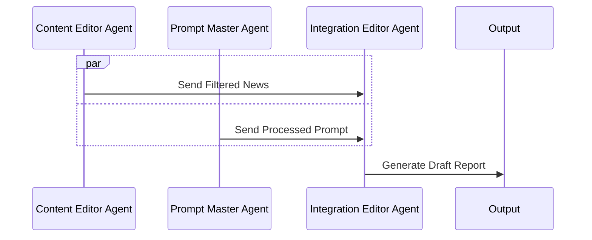
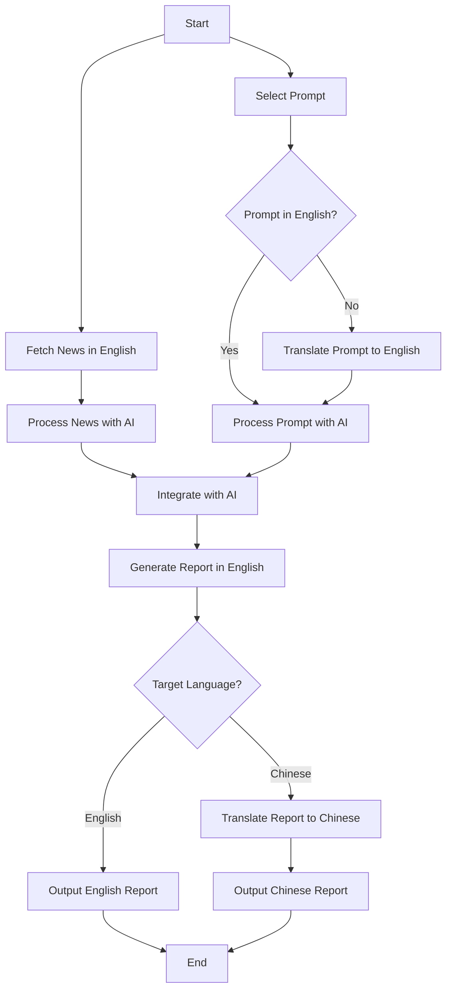

# AI News and Prompt Tips Generator with n8n and AI Agents

  
*Automate AI news and prompt tips for your LinkedIn followers and colleagues.*

---

## Table of Contents

1. [Introduction](#introduction)
2. [Prerequisites](#prerequisites)
3. [Installation](#installation)
4. [Configuration](#configuration)
5. [Usage](#usage)
6. [How It Works](#how-it-works)
7. [Customization](#customization)
8. [Troubleshooting](#troubleshooting)
9. [Contributing](#contributing)
10. [License](#license)

---

## Introduction

This project uses [n8n](https://n8n.io/), a powerful workflow automation tool, combined with AI Agents to automatically generate daily AI news summaries and practical prompt tips. The workflow is designed to help you share relevant AI updates and useful AI prompts with your LinkedIn followers and colleagues interested in AI.

### What the Workflow Does:
- Fetches the latest AI news from curated RSS feeds.
- Selects a random, high-quality AI prompt from a pre-built library.
- Uses AI Agents to filter, translate, and adapt the content for your audience.
- Generates a formatted "AI Daily" report in Markdown, ready for sharing.

This workflow is perfect for automating content creation for internal teams or public audiences, saving time while keeping your community engaged with fresh, relevant AI insights.

### Workflow Overview
The following diagram illustrates the overall data-flow of the workflow, showing how data is fetched, processed, integrated, and saved:



---

## Prerequisites

Before you begin, ensure you have the following:

- **n8n Installed**: You can use the [cloud version](https://n8n.io/pricing/) or [self-host](https://docs.n8n.io/hosting/) it. For self-hosting, follow the [official installation guide](https://docs.n8n.io/hosting/installation/).
- **API Keys**:
  - Access to an AI model API (e.g., [OpenAI](https://openai.com/), [Gemini](https://ai.google.dev/)) for content generation.
  - (Optional) Access to a translation API if you need multi-language support.
- **RSS Feeds**: A list of AI-related RSS feeds (provided in the workflow or customizable).
- **Prompt Library**: A JSON file containing AI prompts (you can use the sample provided or build your own).

**Note**: If you’re new to n8n, check out their [getting started guide](https://docs.n8n.io/getting-started/) for a quick overview.

---

## Installation

### Step 1: Clone the Repository
First, clone this repository to your local machine:

```bash
git clone https://github.com/yourusername/your-repo-name.git
```

### Step 2: Import the Workflow into n8n
1. Open your n8n instance.
2. Go to the **Workflows** tab.
3. Click **Import from File** and select the `workflow.json` file from the cloned repository.
4. The workflow will now appear in your n8n dashboard.

**Tip**: If you’re using the cloud version, you can also import the workflow via URL by providing the GitHub raw file link.

---

## Configuration

To make the workflow functional, you need to configure the following components:

### 1. AI Model API
- **Node**: `AI Agent` (used for content filtering and generation).
- **Setup**:
  - Go to the `AI Agent` node.
  - Select your AI provider (e.g., OpenAI, Gemini).
  - Enter your API key in the credentials section.
  - Adjust the model settings if needed (e.g., temperature, max tokens).

**Example**:
```json
{
  "model": "gpt-4",
  "temperature": 0.7,
  "max_tokens": 150
}
```

### 2. RSS Feeds
- **Node**: `RSS Read` (fetches news from RSS feeds).
- **Setup**:
  - Open the `RSS Read` node.
  - Replace the default RSS feed URLs with your preferred AI news sources.
  - Ensure the node is set to fetch articles from the last 24 hours.

**Sample RSS Feeds**:
- [AWS Machine Learning](https://aws.amazon.com/blogs/machine-learning/feed)
- [arXiv.org cs.ML](http://arxiv.org/rss/cs.LG)

### 3. Prompt Library
- **Node**: `HTTP Request` (fetches the prompt library JSON).
- **Setup**:
  - Upload your `prompt_guides.json` to a public URL (e.g., GitHub, Google Drive).
  - Update the `HTTP Request` node with the URL to your JSON file.
  - Ensure the JSON format matches the sample:
    ```json
    [
      {
        "usage": "Generate a project brief.",
        "template": "Create a brief for a new AI project..."
      },
      ...
    ]
    ```

### 4. Output Settings
- **Node**: `Notion` or `WeChat` (optional, for saving or sharing the output).
- **Setup**:
  - Configure the `Notion` node with your Notion API key and database ID to save the daily report.
  - (Optional) Set up the `WeChat` node for direct posting (requires WeChat API access).

**Pro Tip**: If you don’t use Notion or WeChat, you can replace these nodes with `Email` or `Slack` nodes to send the report to your team.

---

## Usage

### Running the Workflow
1. **Manual Trigger**: Click the **Execute Workflow** button in n8n to run it manually.
2. **Scheduled Trigger**: Set up a `Cron` node to run the workflow daily at a specific time (e.g., every morning at 10 AM).

### Expected Output
- A Markdown-formatted "AI Daily" report containing:
  - 3 curated AI news summaries with links.
  - 1 AI prompt tip with usage instructions.
- The report is saved to Notion (or your chosen output) and can be shared directly.

**Sample Output**:
```markdown
# AI Daily - May 23, 2025

## Top 3 AI News
1. **AWS Launches New ML Service** - AWS unveiled a new service for... [Read more](https://aws.amazon.com/blogs/...)
2. **Breakthrough in NLP** - Researchers at arXiv published... [Read more](http://arxiv.org/...)
3. **AI in Finance** - A new study shows AI's impact on... [Read more](https://example.com/...)

## Daily Prompt Tip
**Usage**: Generate a project brief in one sentence.  
**Template**: "Create a brief for a new AI project focusing on..."
```

---

## How It Works

The workflow relies on multiple AI agents collaborating to produce the final report. The sequence diagram below depicts how these agents interact:



- **Content Editor Agent**: Filters and summarizes news from RSS feeds.
- **Prompt Master Agent**: Processes and refines the selected prompt.
- **Integration Editor Agent**: Combines the news and prompt into a cohesive report.

These agents work in parallel to process their respective inputs before handing them off for integration, ensuring an efficient workflow.

---

## Customization

This workflow is flexible! Here’s how you can tweak it:

### 1. Change News Sources
- Replace the RSS feeds in the `RSS Read` node with your preferred sources.
- Add more sources by duplicating the node and merging the outputs.

### 2. Modify the Prompt Library
- Update the `prompt_guides.json` file with your own prompts.
- Adjust the `Code` node to filter or select prompts differently (e.g., by category).

### 3. Adapt for Different Audiences
- Change the language or tone by editing the prompts in the `AI Agent` nodes.
- For multi-language support, add a translation step using a translation API.

### 4. Integrate with Other Tools
- Replace the `Notion` node with `Google Docs`, `Slack`, or any other integration n8n supports.
- Add notifications (e.g., email alerts) when the workflow runs successfully.

**Pro Tip**: Use n8n’s [community nodes](https://n8n.io/integrations/) to extend functionality with additional services.

### Language Support
The workflow is designed to handle prompts in different languages and generate reports in English or Chinese. The flowchart below depicts the English/Chinese workflow branches and design:



- **Prompt Handling**: Prompts in Chinese are translated to English for processing.
- **Report Output**: The final report can be kept in English or translated to Chinese based on your audience's preference.

---

## Troubleshooting

Here are some common issues and how to fix them:

### 1. API Rate Limits
- **Problem**: Your AI API provider limits the number of requests.
- **Solution**: Add a `Wait` node between API calls or upgrade your API plan.

### 2. RSS Feed Errors
- **Problem**: RSS feeds fail to load or return no data.
- **Solution**: Check the feed URLs and ensure they are active. Use the `Test Step` feature to debug.

### 3. Authentication Issues
- **Problem**: API keys are invalid or expired.
- **Solution**: Double-check your credentials in the n8n settings and renew keys if necessary.

### 4. Output Formatting
- **Problem**: The Markdown output looks messy.
- **Solution**: Adjust the prompts in the `AI Agent` nodes to enforce better formatting.

**Need Help?** Visit the [n8n community forum](https://community.n8n.io/) for support or open an issue in this repository.

---

## Contributing

I’d love for this project to grow with your input! Here’s how you can help:

- **Suggest Improvements**: Open an issue with your ideas or feedback.
- **Report Bugs**: If something’s not working, let me know by filing a bug report.
- **Submit Pull Requests**: Feel free to fork the repo and submit your enhancements.

Please follow the [Contributor Covenant Code of Conduct](https://www.contributor-covenant.org/) when participating.

---

## License

This project is licensed under the MIT License. See the [LICENSE](LICENSE) file for details.

---

### Final Notes

Thank you for checking out this project! I hope it helps you automate your AI content creation and inspires you to explore the power of n8n and AI Agents. If you have any questions or just want to chat about AI, feel free to connect with me on LinkedIn or drop a comment below. Happy automating! 🤖✨
