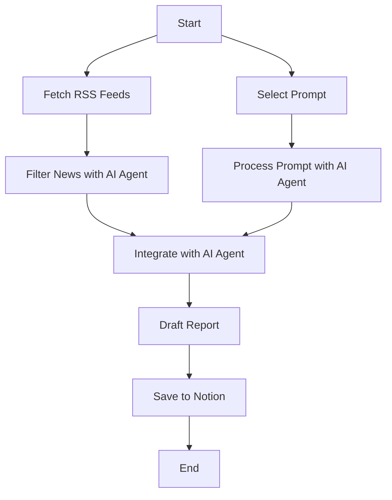
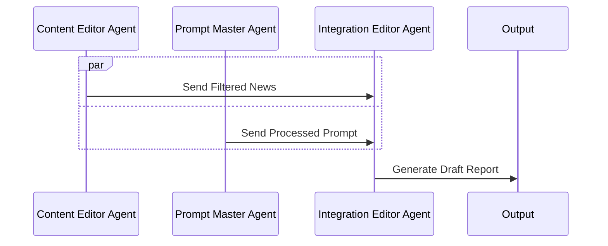
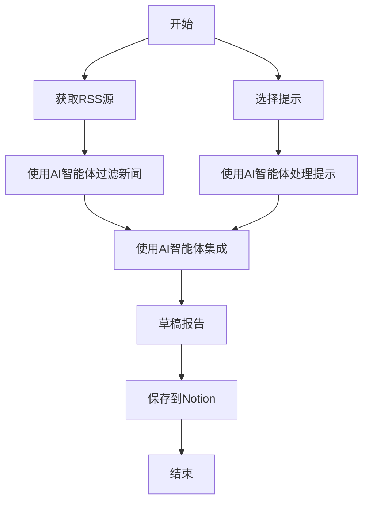
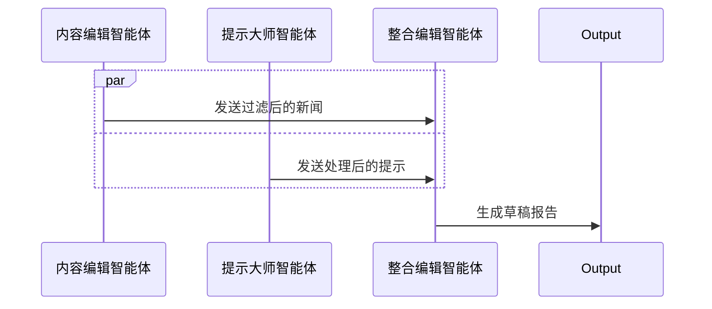

# AI News and Prompt Tips Generator with n8n and AI Agents

  
*Automate AI news and prompt tips for your LinkedIn followers and colleagues.*

---

## Table of Contents
##[中文版](#简介) 
1. [Introduction](#introduction)
2. [Prerequisites](#prerequisites)
3. [Installation](#installation)
4. [Configuration](#configuration)
5. [Usage](#usage)
6. [How It Works](#how-it-works)
7. [Customization](#customization)
8. [Troubleshooting](#troubleshooting)
9. [Contributing](#contributing)
10. [License](#license)

---

## Introduction

This project uses [n8n](https://n8n.io/), a powerful workflow automation tool, combined with AI Agents to automatically generate daily AI news summaries and practical prompt tips. The workflow is designed to help you share relevant AI updates and useful AI prompts with your LinkedIn followers and colleagues interested in AI.

### What the Workflow Does:
- Fetches the latest AI news from curated RSS feeds.
- Selects a random, high-quality AI prompt from a pre-built library.
- Uses AI Agents to filter, translate, and adapt the content for your audience.
- Generates a formatted "AI Daily" report in Markdown, ready for sharing.

This workflow is perfect for automating content creation for internal teams or public audiences, saving time while keeping your community engaged with fresh, relevant AI insights.

### Workflow Overview
The following diagram illustrates the overall data-flow of the workflow, showing how data is fetched, processed, integrated, and saved:



---

## Prerequisites

Before you begin, ensure you have the following:

- **n8n Installed**: You can use the [cloud version](https://n8n.io/pricing/) or [self-host](https://docs.n8n.io/hosting/) it. For self-hosting, follow the [official installation guide](https://docs.n8n.io/hosting/installation/).
- **API Keys**:
  - Access to an AI model API (e.g., [OpenAI](https://openai.com/), [Gemini](https://ai.google.dev/)) for content generation.
  - (Optional) Access to a translation API if you need multi-language support.
- **RSS Feeds**: A list of AI-related RSS feeds (provided in the workflow or customizable).
- **Prompt Library**: A JSON file containing AI prompts (you can use the sample provided or build your own).

**Note**: If you’re new to n8n, check out their [getting started guide](https://docs.n8n.io/getting-started/) for a quick overview.

---

## Installation

### Step 1: Clone the Repository
First, clone this repository to your local machine:

```bash
git clone https://github.com/yourusername/your-repo-name.git
```

### Step 2: Import the Workflow into n8n
1. Open your n8n instance.
2. Go to the **Workflows** tab.
3. Click **Import from File** and select the `workflow.json` file from the cloned repository.
4. The workflow will now appear in your n8n dashboard.

**Tip**: If you’re using the cloud version, you can also import the workflow via URL by providing the GitHub raw file link.

---

## Configuration

To make the workflow functional, you need to configure the following components:

### 1. AI Model API
- **Node**: `AI Agent` (used for content filtering and generation).
- **Setup**:
  - Go to the `AI Agent` node.
  - Select your AI provider (e.g., OpenAI, Gemini).
  - Enter your API key in the credentials section.
  - Adjust the model settings if needed (e.g., temperature, max tokens).

**Example**:
```json
{
  "model": "gpt-4",
  "temperature": 0.7,
  "max_tokens": 150
}
```

### 2. RSS Feeds
- **Node**: `RSS Read` (fetches news from RSS feeds).
- **Setup**:
  - Open the `RSS Read` node.
  - Replace the default RSS feed URLs with your preferred AI news sources.
  - Ensure the node is set to fetch articles from the last 24 hours.

**Sample RSS Feeds**:
- [AWS Machine Learning](https://aws.amazon.com/blogs/machine-learning/feed)
- [arXiv.org cs.ML](http://arxiv.org/rss/cs.LG)

### 3. Prompt Library
- **Node**: `HTTP Request` (fetches the prompt library JSON).
- **Setup**:
  - Upload your `prompt_guides.json` to a public URL (e.g., GitHub, Google Drive).
  - Update the `HTTP Request` node with the URL to your JSON file.
  - Ensure the JSON format matches the sample:
    ```json
    [
      {
        "usage": "Generate a project brief.",
        "template": "Create a brief for a new AI project..."
      },
      ...
    ]
    ```

### 4. Output Settings
- **Node**: `Notion` or `WeChat` (optional, for saving or sharing the output).
- **Setup**:
  - Configure the `Notion` node with your Notion API key and database ID to save the daily report.
  - (Optional) Set up the `WeChat` node for direct posting (requires WeChat API access).

**Pro Tip**: If you don’t use Notion or WeChat, you can replace these nodes with `Email` or `Slack` nodes to send the report to your team.

---

## Usage

### Running the Workflow
1. **Manual Trigger**: Click the **Execute Workflow** button in n8n to run it manually.
2. **Scheduled Trigger**: Set up a `Cron` node to run the workflow daily at a specific time (e.g., every morning at 10 AM).

### Expected Output
- A Markdown-formatted "AI Daily" report containing:
  - 3 curated AI news summaries with links.
  - 1 AI prompt tip with usage instructions.
- The report is saved to Notion (or your chosen output) and can be shared directly.

**Sample Output**:
```markdown
# AI Daily - May 23, 2025

## Top 3 AI News
1. **AWS Launches New ML Service** - AWS unveiled a new service for... [Read more](https://aws.amazon.com/blogs/...)
2. **Breakthrough in NLP** - Researchers at arXiv published... [Read more](http://arxiv.org/...)
3. **AI in Finance** - A new study shows AI's impact on... [Read more](https://example.com/...)

## Daily Prompt Tip
**Usage**: Generate a project brief in one sentence.  
**Template**: "Create a brief for a new AI project focusing on..."
```

---

## How It Works

The workflow relies on multiple AI agents collaborating to produce the final report. The sequence diagram below depicts how these agents interact:



- **Content Editor Agent**: Filters and summarizes news from RSS feeds.
- **Prompt Master Agent**: Processes and refines the selected prompt.
- **Integration Editor Agent**: Combines the news and prompt into a cohesive report.

These agents work in parallel to process their respective inputs before handing them off for integration, ensuring an efficient workflow.

---

## Customization

This workflow is flexible! Here’s how you can tweak it:

### 1. Change News Sources
- Replace the RSS feeds in the `RSS Read` node with your preferred sources.
- Add more sources by duplicating the node and merging the outputs.

### 2. Modify the Prompt Library
- Update the `prompt_guides.json` file with your own prompts.
- Adjust the `Code` node to filter or select prompts differently (e.g., by category).

### 3. Adapt for Different Audiences
- Change the language or tone by editing the prompts in the `AI Agent` nodes.
- For multi-language support, add a translation step using a translation API.

### 4. Integrate with Other Tools
- Replace the `Notion` node with `Google Docs`, `Slack`, or any other integration n8n supports.
- Add notifications (e.g., email alerts) when the workflow runs successfully.

**Pro Tip**: Use n8n’s [community nodes](https://n8n.io/integrations/) to extend functionality with additional services.

---

## Troubleshooting

Here are some common issues and how to fix them:

### 1. API Rate Limits
- **Problem**: Your AI API provider limits the number of requests.
- **Solution**: Add a `Wait` node between API calls or upgrade your API plan.

### 2. RSS Feed Errors
- **Problem**: RSS feeds fail to load or return no data.
- **Solution**: Check the feed URLs and ensure they are active. Use the `Test Step` feature to debug.

### 3. Authentication Issues
- **Problem**: API keys are invalid or expired.
- **Solution**: Double-check your credentials in the n8n settings and renew keys if necessary.

### 4. Output Formatting
- **Problem**: The Markdown output looks messy.
- **Solution**: Adjust the prompts in the `AI Agent` nodes to enforce better formatting.

**Need Help?** Visit the [n8n community forum](https://community.n8n.io/) for support or open an issue in this repository.

---

## Contributing

I’d love for this project to grow with your input! Here’s how you can help:

- **Suggest Improvements**: Open an issue with your ideas or feedback.
- **Report Bugs**: If something’s not working, let me know by filing a bug report.
- **Submit Pull Requests**: Feel free to fork the repo and submit your enhancements.

Please follow the [Contributor Covenant Code of Conduct](https://www.contributor-covenant.org/) when participating.

---

## License

This project is licensed under the MIT License. See the [LICENSE](LICENSE) file for details.

---

### Final Notes

Thank you for checking out this project! I hope it helps you automate your AI content creation and inspires you to explore the power of n8n and AI Agents. If you have any questions or just want to chat about AI, feel free to connect with me on LinkedIn or drop a comment below. Happy automating! 🤖✨

---

# 使用n8n和AI智能体生成AI新闻和提示技巧

   
*为您的LinkedIn粉丝和同事自动生成AI新闻和提示技巧。*

---

## 目录

1. [简介](#简介)
2. [先决条件](#先决条件)
3. [安装](#安装)
4. [配置](#配置)
5. [使用](#使用)
6. [工作原理](#工作原理)
7. [自定义](#自定义)
8. [故障排除](#故障排除)
9. [贡献](#贡献)
10. [许可证](#许可证)

---

## 简介

本项目使用[n8n](https://n8n.io/)（一个强大的工作流自动化工具）结合AI智能体，自动生成每日AI新闻摘要和实用的提示技巧。工作流旨在帮助您与LinkedIn粉丝和对AI感兴趣的同事分享相关的AI更新和有用的AI提示。

### 工作流功能：
- 从精选的RSS源获取最新的AI新闻。
- 从预建库中随机选择高质量的AI提示。
- 使用AI智能体过滤、翻译和调整内容以适应您的受众。
- 生成格式化的Markdown“AI日报”，可直接分享。

此工作流非常适合为内部团队或公众自动化内容创建，节省时间，同时保持社区对最新AI见解的关注。

### 工作流概览
下图展示了工作流的整体数据流，说明了数据如何被获取、处理、集成和保存：



---

## 先决条件

在开始之前，请确保您具备以下条件：

- **n8n已安装**：您可以使用[云版本](https://n8n.io/pricing/)或[自托管](https://docs.n8n.io/hosting/)。自托管请参考[官方安装指南](https://docs.n8n.io/hosting/installation/)。
- **API密钥**：
  - 用于内容生成的AI模型API访问权限（例如[OpenAI](https://openai.com/)、[Gemini](https://ai.google.dev/)）。
  - （可选）如果需要多语言支持，需访问翻译API。
- **RSS源**：AI相关的RSS源列表（工作流中提供或可自定义）。
- **提示库**：包含AI提示的JSON文件（可使用提供的示例或自行构建）。

**注意**：如果您是n8n新手，请查看[入门指南](https://docs.n8n.io/getting-started/)以快速了解。

---

## 安装

### 步骤1：克隆仓库
首先，将此仓库克隆到本地机器：

```bash
git clone https://github.com/yourusername/your-repo-name.git
```

### 步骤2：将工作流导入n8n
1. 打开您的n8n实例。
2. 转到**工作流**选项卡。
3. 点击**从文件导入**，选择克隆仓库中的`workflow.json`文件。
4. 工作流将出现在您的n8n仪表板中。

**提示**：如果使用云版本，您还可以通过提供GitHub原始文件链接来通过URL导入工作流。

---

## 配置

要使工作流正常运行，您需要配置以下组件：

### 1. AI模型API
- **节点**：`AI智能体`（用于内容过滤和生成）。
- **设置**：
  - 转到`AI智能体`节点。
  - 选择您的AI提供商（例如OpenAI、Gemini）。
  - 在凭据部分输入您的API密钥。
  - 如有需要，调整模型设置（例如温度、最大令牌数）。

**示例**：
```json
{
  "model": "gpt-4",
  "temperature": 0.7,
  "max_tokens": 150
}
```

### 2. RSS源
- **节点**：`RSS读取`（从RSS源获取新闻）。
- **设置**：
  - 打开`RSS读取`节点。
  - 将默认的RSS源URL替换为您首选的AI新闻源。
  - 确保节点设置为获取过去24小时的文章。

**示例RSS源**：
- [AWS机器学习](https://aws.amazon.com/blogs/machine-learning/feed)
- [arXiv.org cs.ML](http://arxiv.org/rss/cs.LG)

### 3. 提示库
- **节点**：`HTTP请求`（获取提示库JSON）。
- **设置**：
  - 将您的`prompt_guides.json`上传到公共URL（例如GitHub、Google Drive）。
  - 更新`HTTP请求`节点，指向您的JSON文件URL。
  - 确保JSON格式与示例匹配：
    ```json
    [
      {
        "usage": "生成项目简报。",
        "template": "为新AI项目创建简报..."
      },
      ...
    ]
    ```

### 4. 输出设置
- **节点**：`Notion`或`WeChat`（可选，用于保存或分享输出）。
- **设置**：
  - 使用您的Notion API密钥和数据库ID配置`Notion`节点以保存日报。
  - （可选）设置`WeChat`节点以直接发布（需要WeChat API访问权限）。

**专业提示**：如果不使用Notion或WeChat，您可以将这些节点替换为`Email`或`Slack`节点，将报告发送给您的团队。

---

## 使用

### 运行工作流
1. **手动触发**：在n8n中点击**执行工作流**按钮手动运行。
2. **定时触发**：设置`Cron`节点以每天在特定时间运行工作流（例如每天上午10点）。

### 预期输出
- 格式化为Markdown的“AI日报”，包含：
  - 3篇精选AI新闻摘要及链接。
  - 1个AI提示技巧及使用说明。
- 报告保存到Notion（或您选择的输出）并可直接分享。

**示例输出**：
```markdown
# AI日报 - 2025年5月23日

## 今日AI新闻Top 3
1. **AWS推出新ML服务** - AWS发布了一项新服务... [阅读更多](https://aws.amazon.com/blogs/...)
2. **NLP领域突破** - arXiv研究人员发表... [阅读更多](http://arxiv.org/...)
3. **AI在金融中的应用** - 新研究显示AI对... [阅读更多](https://example.com/...)

## 每日提示技巧
**用途**：用一句话生成项目简报。  
**模板**：“为关注...的新AI项目创建简报”
```

---

## 工作原理

工作流依赖多个AI智能体协作生成最终报告。下面的时序图展示了这些智能体如何交互：



- **内容编辑智能体**：过滤和摘要RSS源中的新闻。
- **提示大师智能体**：处理和优化选定的提示。
- **整合编辑智能体**：将新闻和提示组合成一份连贯的报告。

这些智能体并行工作，处理各自的输入，然后传递给整合编辑智能体，确保工作流高效运行。

---

## 自定义

此工作流非常灵活！以下是您可以调整的方式：

### 1. 更改新闻源
- 将`RSS读取`节点中的RSS源替换为您首选的源。
- 通过复制节点并合并输出以添加更多源。

### 2. 修改提示库
- 更新`prompt_guides.json`文件以包含您自己的提示。
- 调整`代码`节点以不同方式过滤或选择提示（例如按类别）。

### 3. 适应不同受众
- 通过编辑`AI智能体`节点中的提示来更改语言或语气。
- 对于多语言支持，使用翻译API添加翻译步骤。

### 4. 集成其他工具
- 将`Notion`节点替换为`Google Docs`、`Slack`或n8n支持的任何其他集成。
- 在工作流成功运行时添加通知（例如电子邮件警报）。

**专业提示**：使用n8n的[社区节点](https://n8n.io/integrations/)以扩展功能。

---

## 故障排除

以下是一些常见问题及其解决方法：

### 1. API速率限制
- **问题**：您的AI API提供商限制了请求数量。
- **解决方法**：在API调用之间添加`等待`节点或升级您的API计划。

### 2. RSS源错误
- **问题**：RSS源无法加载或未返回数据。
- **解决方法**：检查源URL并确保其有效。使用`测试步骤`功能进行调试。

### 3. 认证问题
- **问题**：API密钥无效或已过期。
- **解决方法**：在n8n设置中仔细检查您的凭据，并根据需要更新密钥。

### 4. 输出格式问题
- **问题**：Markdown输出看起来杂乱。
- **解决方法**：调整`AI智能体`节点中的提示以强制更好的格式。

**需要帮助？** 请访问[n8n社区论坛](https://community.n8n.io/)寻求支持或在此仓库中打开一个issue。

---

## 贡献

我希望这个项目能在您的输入下不断成长！以下是您可以帮助的方式：

- **建议改进**：通过issue提出您的想法或反馈。
- **报告错误**：如果发现问题，请提交错误报告。
- **提交拉取请求**：欢迎fork仓库并提交您的改进。

参与时请遵守[Contributor Covenant行为准则](https://www.contributor-covenant.org/)。

---

## 许可证

本项目采用MIT许可证。详情请见[LICENSE](LICENSE)文件。

---

### 结语

感谢您查看此项目！希望它能帮助您自动化AI内容创建，并激励您探索n8n和AI智能体的强大功能。如果您有任何问题或想聊聊AI，请随时在LinkedIn上与我联系或在下方留言。祝您自动化愉快！🤖✨
