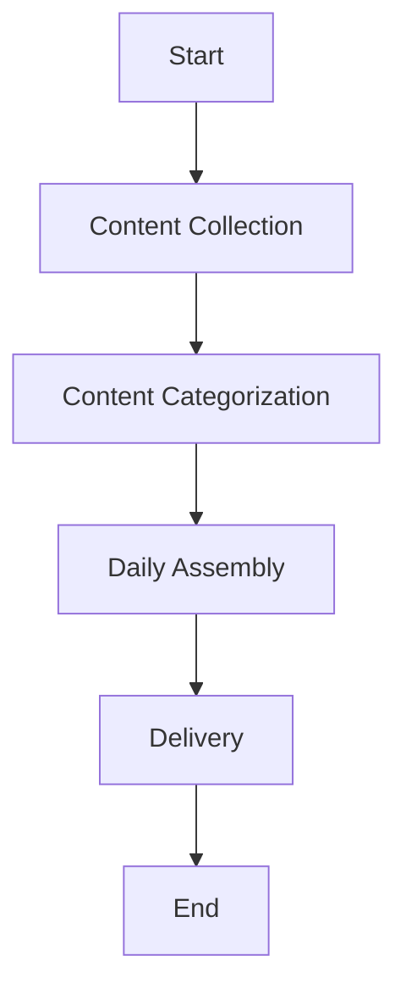
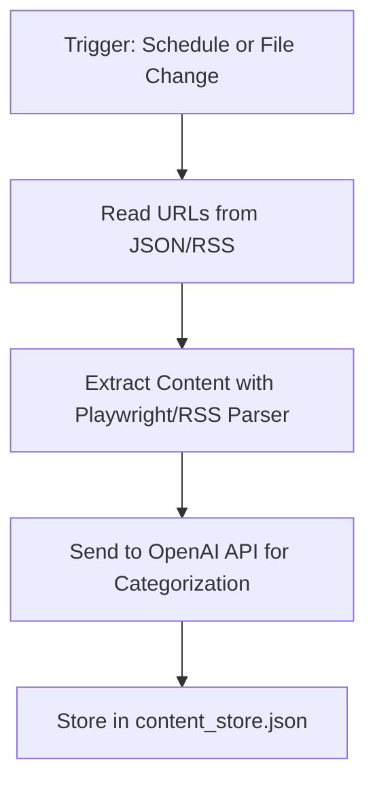
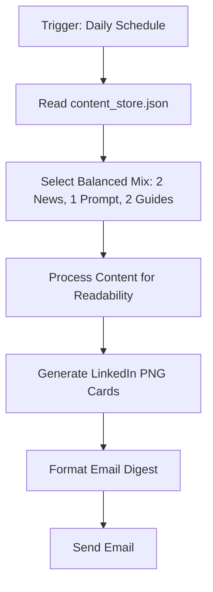
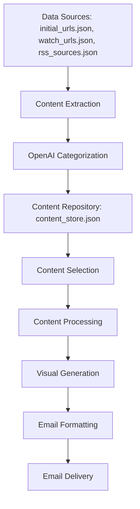

# Product Requirements Document (PRD): AI Content Curation Agent

Below is a complete Product Requirements Document (PRD) for building an AI Content Curation Agent. This document outlines the system’s purpose, workflow, requirements, architecture, and diagrams to help you understand how to automate the collection, processing, and delivery of AI-related content. The design is kept simple and practical, leveraging modern tools like n8n and OpenAI API, while avoiding overcomplication—perfect for learning AI agent building.

---

## 1. Overview

The **AI Content Curation Agent** automates the collection, categorization, processing, and delivery of AI-related content. It sources content from WeChat public account articles and RSS feeds, categorizes it into "news," "prompts," or "guides" using the OpenAI API, assembles a daily mix, processes it for readability, creates visual assets for social sharing (LinkedIn PNG cards), and delivers the final product via email. The system is designed to be straightforward, leveraging your experience as an AI coder with 5 successful projects while providing a learning opportunity.

---

## 2. Objectives

- **Automation**: Minimize manual effort in collecting and curating AI content.
- **Simplicity**: Keep the system easy to build, understand, and maintain.
- **Relevance**: Deliver high-quality, categorized AI content daily.
- **Engagement**: Enhance content with visuals for social media sharing.
- **Learning**: Provide a practical foundation for exploring AI agent development.

---

## 3. Functional Requirements

### 3.1 Content Collection
- **Sources**:
  - WeChat public account articles (scraped using Playwright from URLs you provide).
  - RSS feeds for real-time AI news (e.g., AI blogs, arXiv).
- **Input Mechanisms**:
  - **Cold-Start**: A JSON file (`initial_urls.json`) with WeChat article URLs you provide initially.
  - **Ongoing Addition**: A JSON file (`watch_urls.json`) where you drop new URLs as discovered.
  - **Real-Time**: A JSON file (`rss_sources.json`) listing RSS feed URLs.
- **Processing**:
  - Extract content (title, body text) from WeChat articles using Playwright.
  - Parse RSS feeds to gather articles.
  - Store all collected content in a JSON file (`content_store.json`).

### 3.2 Content Categorization
- **Categories**:
  - **News**: Current AI developments, updates, or industry announcements.
  - **Prompts**: Techniques or examples for interacting with AI models.
  - **Guides**: Educational how-to content or skill-building material.
- **Method**: Use the OpenAI API to analyze the title and a content excerpt, assigning each item to one of the three categories.
- **Storage**: Update `content_store.json` with categorized content, including category labels.

### 3.3 Daily Assembly
- **Selection**: Compile a daily mix (e.g., 2 news, 1 prompt, 2 guides) from `content_store.json`.
- **Processing**: Simplify and reformat content for readability (e.g., shorten sentences, clarify jargon).
- **Visual Assets**: Generate PNG cards for LinkedIn, highlighting key points from each item.

### 3.4 Delivery
- **Format**: Package the daily mix into an email digest with text and attached visuals.
- **Schedule**: Deliver the email every morning.
- **Content**: Include the processed content and LinkedIn cards.

---

## 4. Non-Functional Requirements
- **Performance**: Process and categorize content quickly enough for daily delivery.
- **Scalability**: Allow easy addition of new URLs or RSS feeds via JSON files.
- **Reliability**: Ensure consistent email delivery without downtime.
- **Usability**: Require minimal setup and maintenance, relying on simple JSON files and n8n workflows.

---

## 5. Technical Architecture

### 5.1 Directory Structure
```
ai-content-curator/
├── content/
│   ├── initial_urls.json      # Initial WeChat URLs
│   ├── watch_urls.json        # New URLs you add
│   ├── rss_sources.json       # RSS feed URLs
│   └── content_store.json     # Categorized content repository
├── scripts/                   # Placeholder for logic (no code here)
│   ├── scraper.py
│   ├── categorizer.py
│   ├── assembler.py
│   └── formatter.py
├── n8n/
│   ├── collect_workflow.json  # Content collection workflow
│   └── delivery_workflow.json # Daily assembly and delivery
└── config.json                # API keys and settings
```

### 5.2 Tools and Technologies
- **Playwright**: Scrape WeChat articles from provided URLs.
- **OpenAI API**: Categorize content into "news," "prompts," or "guides."
- **n8n**: Automate workflows and schedule tasks (e.g., collection, delivery).
- **JSON**: Store content and configuration data.
- **PIL (Pillow)**: Generate PNG cards for LinkedIn posts.

---

## 6. Workflow and Data Flow Diagrams

### 6.1 Overall Workflow
This diagram shows the high-level process from content collection to delivery:



- **Content Collection**: Gathers content from WeChat URLs (initial and watched) and RSS feeds.
- **Content Categorization**: Uses OpenAI API to label content as "news," "prompts," or "guides."
- **Daily Assembly**: Selects and processes a mix of content, generating visuals.
- **Delivery**: Sends the email digest.

### 6.2 n8n Workflow Implementation

#### 6.2.1 Content Collection Workflow
This workflow runs daily or when you update `watch_urls.json`:



- **Trigger**: Activates on a schedule (e.g., daily) or when `watch_urls.json` changes.
- **Actions**: Reads URLs, extracts content, categorizes it, and stores it.

#### 6.2.2 Daily Assembly and Delivery Workflow
This workflow runs every morning:



- **Trigger**: Starts daily in the morning.
- **Actions**: Selects content, processes it, creates visuals, and sends the email.

### 6.3 Data Flow Architecture
This diagram illustrates how data moves through the system:



- **Data Sources**: Your JSON files provide URLs and RSS feeds.
- **Processing**: Content is extracted, categorized, and stored.
- **Output**: Selected content is processed, turned into visuals, and emailed.

---

## 7. Implementation Steps

1. **Set Up Base Structure**:
   - Create the directory structure and JSON files.
   - Install and configure an n8n instance (Docker or cloud).

2. **Implement Content Collection**:
   - Use Playwright to scrape WeChat articles from URLs in `initial_urls.json` and `watch_urls.json`.
   - Parse RSS feeds from `rss_sources.json`.
   - Set up OpenAI API to categorize content into three categories.

3. **Create Daily Assembly Process**:
   - Select a balanced mix of content daily (e.g., 2 news, 1 prompt, 2 guides).
   - Process content for readability and generate LinkedIn PNG cards.

4. **Configure Delivery**:
   - Use n8n to format and schedule the email digest for morning delivery.

---

## 8. Extension Possibilities
- **Content Scoring**: Add basic scoring with OpenAI for quality filtering.
- **Deduplication**: Track used content to avoid repetition.
- **Additional Formats**: Extend to Twitter or Instagram posts.
- **Feedback**: Add a reply mechanism to refine content selection.
- **Analytics**: Track email opens or social engagement.

---

## 9. Key Takeaways for Learning
- **Workflow Automation**: n8n simplifies scheduling and task orchestration.
- **AI Integration**: OpenAI API handles categorization with minimal setup.
- **Content Processing**: Basic reformatting and visual creation are achievable steps.
- **Scalability**: JSON-based storage keeps it simple yet expandable.

This PRD provides a clear roadmap for building your AI Content Curation Agent. It balances automation with simplicity, using tools like Playwright, OpenAI, and n8n to create a functional system you can build and learn from. Let me know if you'd like me to dive deeper into any section!
