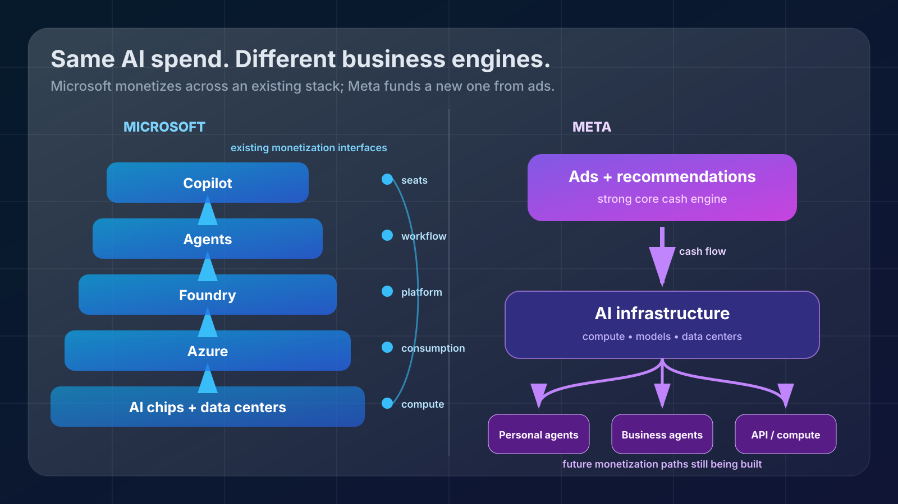
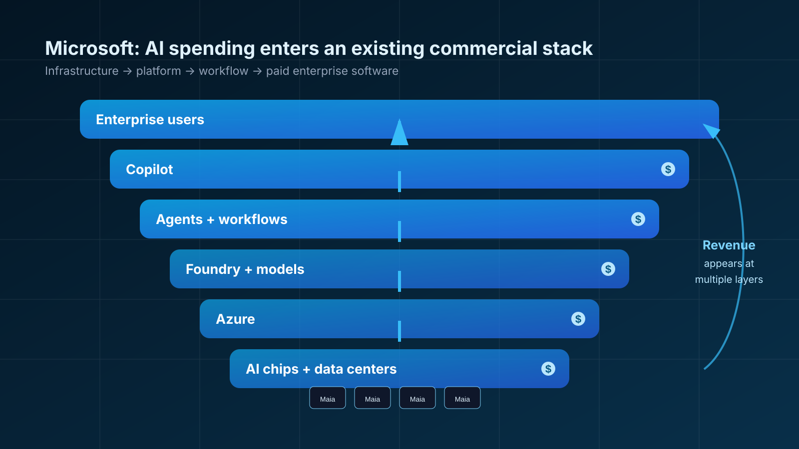
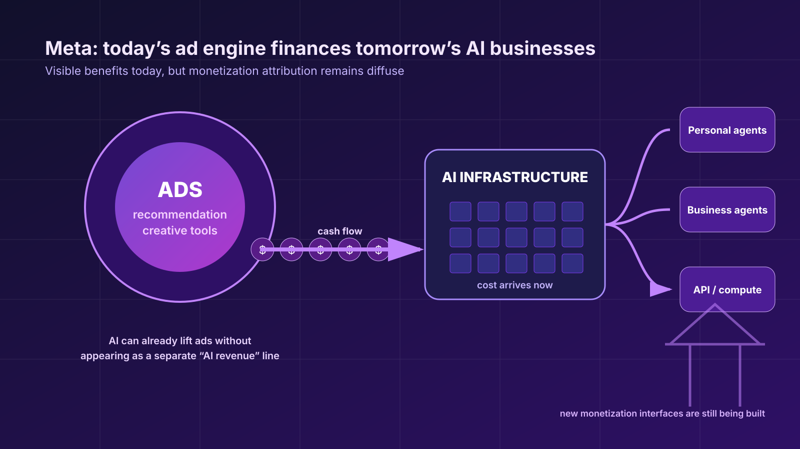
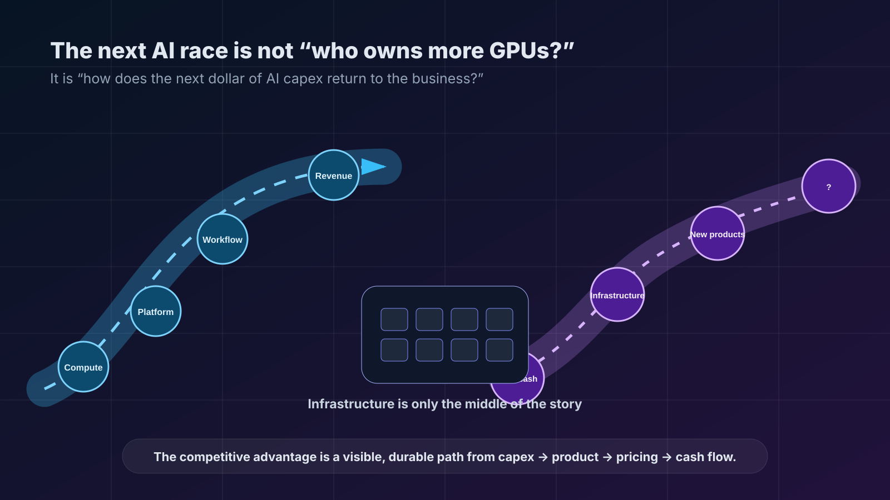

# 同样砸钱建 AI，Microsoft 和 Meta 其实不是同一场比赛

2026 年 7 月 29 日，Microsoft 和 Meta 在同一天交出了最新财报。

表面上看，这是又一次 Big Tech AI 军备竞赛的季度检查：数据中心建了多少，GPU 买了多少，资本开支又涨了多少。

但把两份财报放在一起，真正值得关注的并不是“谁花得更多”。

更重要的问题是：

**同样把数百亿美元投入 AI 基础设施，这些钱究竟准备通过什么路径变成收入和现金流？**

Microsoft 最新季度资本开支达到 **410 亿美元**，却仍创造了 **196 亿美元自由现金流**。Azure 收入同比增长 **43%**，全年收入首次超过 **1000 亿美元**，Microsoft 365 Copilot 已超过 **3000 万付费席位**。

Meta 同样没有停止扩张。第二季度资本开支达到 **310.8 亿美元**，全年资本开支指引为 **1300 亿至 1450 亿美元**。但当季 **318.6 亿美元经营现金流**，扣除巨额基础设施投入后，自由现金流只剩 **7.84 亿美元**，同比下降约 **91%**。

如果只看这组数字，很容易得到一个诱人的结论：

Microsoft 的 AI 投资开始赚钱了，而 Meta 还在烧钱。

这个结论太简单。

因为 Microsoft 和 Meta 虽然都在购买 GPU、建设数据中心、训练模型、开发 Agent，但它们实际上并不是在玩同一种商业游戏。

*图 1：同样投入 AI 基础设施，Microsoft 与 Meta 面对的是两套不同的商业回报系统。*

---

## Microsoft 的优势，不只是 Azure 增长了 43%

Microsoft 本季度最醒目的数字当然是 Azure。

截至 2026 年 6 月 30 日的 FY26 Q4，Microsoft 总收入达到 **900 亿美元**，Microsoft Cloud 收入达到 **593 亿美元**，Azure and other cloud services 收入同比增长 **43%**，高于 Reuters 引述的约 40% 市场预期。

但如果只把这理解成“AI 拉动云增长”，其实还是漏掉了 Microsoft 当前 AI 战略最重要的结构：

**Microsoft 正试图控制从芯片一直延伸到最终企业用户的整条 AI 商业栈。**

最底层是数据中心和算力。

公司表示，本季度新增 **31 个数据中心**，整个财年累计新增 **88 个**；单季度新增约 **1GW** 容量，并计划在两年内大致把整体容量翻倍。

再往上一层，是自研硬件。

Microsoft 正在推进 Maia 系列 AI 芯片。管理层称，Maia 200 在特定内部比较中实现了约 **30% 更好的 performance per dollar**，并披露过约 **40% performance per watt** 的改善。

这些数字目前主要来自 Microsoft 自身测试，并没有统一第三方基准，因此不能把它们直接当成已经被独立验证的成本优势。

但战略方向已经很清楚：

Microsoft 不希望永远只是 NVIDIA GPU 的大型采购方。

再往上一层，是模型。

Microsoft 已经不再把自己的 AI 战略完全绑定在单一模型供应商上。除了 OpenAI，它的平台还提供 Anthropic、Mistral、xAI 等公司的模型，同时开发自己的 MAI 模型。

Satya Nadella 在电话会上给出了一个很值得注意的数据：

**从 2026 年初至今，使用多家模型供应商构建应用的 Microsoft 客户数量增长了 5 倍。**

这意味着 Microsoft 想卖的已经不再只是某个“大模型”。

它正在把模型逐渐变成平台中的可替换组件。

而真正关键的一层，是收费接口。

*图 2：Microsoft 的优势不是资本开支更低，而是从芯片、Azure、Foundry、Agent 到 Copilot，多层都已有可收费接口。*

---

## Microsoft 每增加一层 AI 能力，都已经有地方收钱

这是 Microsoft 与许多 AI 重投入公司最大的区别。

一家企业需要算力，可以购买 Azure。

需要调用和管理模型，可以进入 Foundry。

需要构建和治理 Agent，可以继续使用 Microsoft 的企业平台。

需要把 AI 放进员工日常工作流，则可以购买 Microsoft 365 Copilot。

从数据中心到最终用户，Microsoft 几乎每一层都已经存在一个成熟、或者至少正在成熟的收费接口。

本季度的几组数据正好把这条链条展示了出来：

- Azure 全年收入首次超过 **1000 亿美元**
- Microsoft 365 Copilot 超过 **3000 万付费席位**
- Foundry 达到 **10 万客户**，收入同比翻倍以上
- 商业剩余履约义务达到 **6780 亿美元**

这些指标当然不能全部算成“AI 收入”。

Azure 包含大量传统云业务，6780 亿美元的商业剩余履约义务也绝不是纯 AI 合同。

Microsoft 到目前为止，同样没有披露一个可以直接与 410 亿美元季度资本开支配对的“AI 收入”“AI 毛利”或者“AI 投资回报率”。

所以，说 Microsoft 的 AI 投资已经完全自我偿付，证据远远不够。

但 Microsoft 已经具备一个非常重要的优势：

**AI 投入如何穿过技术栈，最终进入收费产品，这条路径已经可以被观察。**

芯片试图降低推理成本。

更大的算力容量支持 Azure。

模型进入 Foundry。

Agent 进入企业工作流。

Copilot 按席位收费。

企业合同最终进入 Azure、Microsoft 365 和商业 backlog。

这就是为什么同样面对惊人的资本开支，市场对 Microsoft 的容忍度会发生变化。

不是因为 Microsoft 停止烧钱了。

恰恰相反，公司预计 FY27 第一季度资本开支还将超过 **500 亿美元**。

真正发生变化的是：

**投资者开始越来越清楚地看到，这些钱准备从哪里回来。**

---

## Meta 的问题完全不同：AI 回报首先藏在广告机器里面

Meta 第二季度的数据看起来要刺眼得多。

收入 **608.01 亿美元**，同比增长 **28%**。

这是非常强劲的增长。

但与此同时，总成本和费用增长 **55%**，达到 **420.26 亿美元**；营业利润同比下降 **8%**；净利润同比下降 **14%**。

经营现金流依然高达 **318.6 亿美元**。

然后来了基础设施账单。

资本开支达到 **310.8 亿美元**。

最终自由现金流只剩下 **7.84 亿美元**。

去年同期是 **85.5 亿美元**。

也就是说，自由现金流同比下降约 **91%**。

但如果因此说“Meta 花了这么多钱，却没有 AI 回报”，同样不准确。

Meta 已经明确表示，AI 正在改善它今天最重要的业务——广告。

本季度广告展示量增长 **14%**，平均广告价格增长 **12%**。

公司还披露，已经有约 **900 万小商家**在使用至少一种 AI 广告创意工具。

超过 **100 万家企业**每周通过 Meta 的 Business Agents 与客户互动或者完成销售相关任务。

这些都是真实的产品采用信号。

问题在于：

Meta 的这些 AI 收益，并不像 Azure 或 Copilot 那样容易被单独列成一条收入线。

一个更好的推荐模型可能让用户多刷几分钟 Instagram。

更准确的广告排序可能提高点击率。

AI 生成广告素材可能让一个小企业更容易增加投放。

更智能的系统可能提高每千次展示产生的商业价值。

这些改善最终都会进入 Meta 庞大的广告机器。

但它们不会出现在财报中一个叫做“AI Revenue”的栏目里。

因此，Meta 面临的是一个非常典型的归因问题：

**AI 可能已经在赚钱，但外界很难知道究竟赚了多少钱。**

---

## Meta 正在用今天的广告机器，给明天的第二商业模式融资

这才是两家公司真正不同的地方。

Microsoft 的 AI 战略，大部分是在扩张一个已经存在的商业模式。

企业本来就在购买云计算。

企业本来就在购买 Microsoft 365。

开发者本来就在购买开发平台。

Microsoft 要做的是把 AI 塞进这些已经存在的收费接口，并提高客户使用量和价值。

Meta 面临的任务要困难得多。

它今天主要仍是一家广告公司。

但 Zuckerberg 描绘的 AI 未来明显已经超出了广告。

在最新 prepared remarks 中，他谈到了个人 Agent、Business Agents、API，以及潜在的直接算力销售。

换句话说，Meta 不只是希望 AI 帮 Facebook 和 Instagram 多卖一点广告。

它还在尝试建立新的企业和消费者 AI 商业模式。

这带来了一个非常重要的时间错配：

**基础设施成本已经进入今天的现金流，而许多新商业模式还属于明天。**

数据中心今天就要建。

GPU 今天就要买。

第三方云今天就要付钱。

AI token 成本今天就在发生。

研究人员今天就需要薪酬。

但个人 Agent 是否会成为一个巨大的消费者业务？

Business Agents 能否形成大规模独立收入？

API 会不会成为 Meta 新的平台型业务？

Meta 是否真的会向外部客户直接出售算力？

这些收入目前都没有被完整证明。

于是 Meta 的广告业务实际上承担了双重任务。

一方面，它必须继续支撑公司今天的利润。

另一方面，它还必须给一套可能重塑 Meta 自身商业模式的 AI 基础设施融资。

这也是为什么 Meta 当前的资本压力显得特别大。

*图 3：Meta 的现实回报首先进入广告机器，而广告现金流又反过来为基础设施和尚未成熟的 Agent、API 等业务融资。*

---

## Microsoft 在扩张现有收费系统，Meta 在创造新的收费系统

从这个角度看，两家公司的区别就清晰很多。

Microsoft 所承担的主要风险是：

它能否在巨额基础设施投资之后，继续让 Azure、Copilot、Foundry 和 Agent 产品产生足够高的使用量和毛利。

这是一个很大的风险。

但商业接口已经存在。

Meta 所承担的风险则多了一层。

它不仅需要证明模型和基础设施有效，还要证明未来用户真的需要新的个人 Agent、Business Agent 和 API 产品，而且这些产品最终拥有足够强的收费能力。

换句话说：

**Microsoft 更多是在扩大收费管道。**

**Meta 则在一边扩大基础设施，一边设计新的收费管道。**

这两种战略承担的组织风险完全不同。

Microsoft 可以把一个新模型放进现有 Azure 和 Foundry 生态。

甚至模型本身都不一定必须来自 Microsoft。

这也是多模型战略真正重要的地方。

Microsoft 的核心资产不一定是“永远拥有全球最强模型”。

它更希望拥有的是：

模型运行的地方，

企业开发 Agent 的地方，

管理身份和权限的地方，

以及用户最终工作的地方。

模型可以变化。

商业关系最好不要变化。

Meta 则没有这么简单。

如果它未来希望通过 Agent、API 或算力形成真正意义上的第二收入曲线，那么产品本身、用户需求、平台生态以及收费模式都需要同时成立。

所以 Meta 的问题从来不是简单的：

“有没有足够的钱买 GPU？”

它真正需要证明的是：

**这些 GPU 最终会把 Meta 变成一家什么样的公司。**

---

## 但不要低估 Meta 的广告机器

这里必须加入一个重要的反方观点。

Microsoft 的回报更容易测量，并不等于 Microsoft 的真实回报一定更高。

Meta 的回报难以拆分，也不等于它不存在。

事实上，广告业务可能恰恰是 AI 最强大的变现机器之一。

因为它拥有巨大的规模。

对于一个拥有数十亿用户和数百亿美元季度收入的平台来说，推荐准确度、广告匹配、创意生成或者转化率哪怕只提高一点点，都可能对应巨大的经济价值。

而这种价值不需要用户额外购买一个叫“Meta AI Pro”的产品才会产生。

它可以静悄悄地进入广告价格、展示数量和广告主 ROI。

本季度 Meta 收入仍然增长 **28%**，广告展示量增长 **14%**，平均广告价格增长 **12%**。

所以，更准确的判断不是：

“Meta AI 还没有赚钱。”

而是：

**Meta 目前没有提供足够清晰的财务拆账，让外部投资者判断 AI 到底贡献了多少收入和利润。**

这是两个完全不同的命题。

*图 4：基础设施只是中间环节。下一阶段真正拉开差距的是从 CapEx 到产品、定价和现金流的回路是否清晰、持久。*

---

## 真正的 AI 资本竞赛，正在从“谁有更多 GPU”进入下一阶段

过去几年，大型科技公司的 AI 竞争经常被简化成基础设施竞赛。

谁买到更多 GPU。

谁拥有更多数据中心。

谁的训练集群更大。

谁能签下更多电力。

但当每家公司每年的 AI 基础设施投入开始迈向千亿美元级别时，单纯证明“我们有很多算力”已经不够。

下一阶段的问题会越来越直接：

这些算力进入了什么产品？

产品通过什么方式收费？

使用量是否增长？

推理成本是否下降？

收入是否足以覆盖不断增加的折旧、能源和芯片更新？

最终能不能形成现金流？

从这个角度看，2026 年 7 月 29 日 Microsoft 和 Meta 的两份财报，可能揭示了 AI 基础设施竞争真正的下一阶段。

不是 CapEx 会不会继续增长。

两家公司都已经明确告诉市场：会。

真正开始分化的是：

**每家公司有没有能力解释，新增的下一美元 AI 投资最终怎样回到自己的商业系统里。**

Microsoft 当前的答案已经相对清晰。

从 Maia 到 Azure，从模型到 Foundry，从 Agent 到 Copilot，它正在建立一套纵向整合、同时允许模型替换的企业 AI 商业栈。

Meta 的答案则更复杂。

今天，它首先通过 AI 增强广告机器；与此同时，又希望利用这台广告现金机器去孵化个人 Agent、Business Agents、API 和潜在算力业务。

Microsoft 在把 AI 加进一个已经成熟的收费体系。

Meta 则在试图让 AI 帮它创造下一套收费体系。

这并不能告诉我们十年之后谁会赢。

但它解释了为什么，在今天，即使两家公司买的是类似的 GPU、建设的是类似的数据中心，它们的财务报表看起来却会如此不同。

**同样是 AI 基础设施投资，它们其实从来就不是同一场比赛。**

---

## 主要来源

1. Microsoft Investor Relations — *FY26 Q4 Press Release & Webcast*  
https://www.microsoft.com/en-us/investor/earnings/fy-2026-q4/press-release-webcast

2. Microsoft Investor Relations — *FY26 Q4 Earnings Conference Call*  
https://www.microsoft.com/en-us/investor/events/fy-2026/earnings-fy-2026-q4

3. Meta Investor Relations — *Meta Reports Second Quarter 2026 Results*  
https://investor.atmeta.com/investor-news/press-release-details/2026/Meta-Reports-Second-Quarter-2026-Results/default.aspx

4. Meta Investor Relations — *META Q2 2026 Prepared Remarks*  
https://s21.q4cdn.com/399680738/files/doc_financials/2026/q2/META-Q2-2026-Prepared-Remarks.pdf

5. Reuters — *Microsoft says cash will keep flowing from AI, shares rise*  
https://www.reuters.com/business/microsoft-tops-quarterly-cloud-growth-estimates-easing-spending-concerns-2026-07-29/

6. Reuters — *Meta cash flow craters as Zuckerberg doubles down on AI spending*  
https://www.reuters.com/business/meta-narrows-annual-capex-forecast-ai-buildout-grows-2026-07-29/